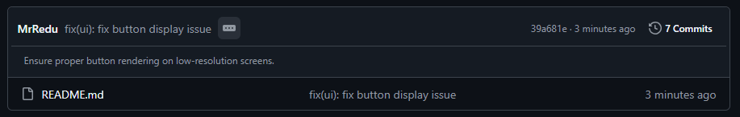
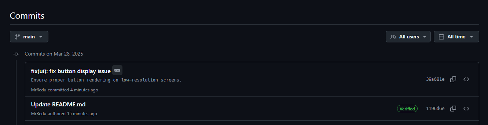

# Hoja de referencia: Conventional Commits

Entendemos commit como una **operación que guarda los cambios realizados en un repositorio.** Hay que pensarlo como una "instantánea/screenshot" del estado de un proyecto en un momento determinado. Cada commit **registra los cambios que se han hecho en los archivos,** junto con un mensaje que describe qué se ha modificado y por qué.

## Paso 1: Elegir el tipo del commit

Empezar el mensaje con un tipo que refleje la naturaleza del cambio:

| Etiqueta   | Descripción                                                  |
| :--------- | :----------------------------------------------------------- |
| `feat`     | Añadir una nueva funcionalidad.                              |
| `fix`      | Corregir un error.                                           |
| `docs`     | Actualizar documentación.                                    |
| `style`    | Cambio en los estilos (formateo, espacios en blancos, etc).  |
| `refactor` | Reestructuración del código sin cambiar funcionalidades.     |
| `perf`     | Mejoras de rendimiento.                                      |
| `test`     | Añadir o actualizar pruebas.                                 |
| `build`    | Cambios en los scripts de compilación o en las dependencias. |
| `ci`       | Actualizaciones de las configuraciones CI/CD.                |
| `chore`    | Otras tareas (e.g., actualizando el _.gitignore_).           |
| `revert`   | Revertir un commit anterior.                                 |

### Ejemplos:

- `fix`: fix token validation issue
- `feat`: add support for dark mode
- `docs`: update API documentation
- `refactor`: simplify database query logic
- `perf`: optimize image loading performance
- `test`: add unit tests for new features
- `build`: update build script to use latest dependencies
- `chore`: update project dependencies to latest versions

## Paso 2: Especificar un alcance (opcional)

El alcance aclara la zona afectada del proyecto.

| Etiqueta | Descripción                     |
| :------- | :------------------------------ |
| `auth`   | Autenticación y autorización.   |
| `ui`     | Interfaz de usuario.            |
| `api`    | API de backend o frontend.      |
| `core`   | Funciones básicas.              |
| `config` | Archivos de configuración.      |
| `deps`   | Actualizaciones de dependencia. |
| `tests`  | Pruebas.                        |
| `docs`   | Documentación.                  |
| `db`     | Cambios en la base de datos.    |

### Ejemplos:

- docs`(readme)`: add installation instructions
- feat`(auth)`: add MFA (multi-factor authentication) support
- fix`(ui)`: correct mobile menu overflow bug
- refactor`(api)`: migrate user endpoints to GraphQL

## Paso 3: Escribir una descripción breve

La descripción debe ser breve y clara.

### Ejemplos:

- auth: `implement JWT token validation`
- fix(db): `fix connection timeout issue`
- config: `add environment variables for staging`
- feat: `add dark mode toggle component`
- refactor: `clean up legacy payment code`
- ci: `set up GitHub Actions for automated testing`
- fix: `resolve memory leak in data processing`
- feat(i18n): `add Spanish language support`
- perf: `reduce API response time with caching`
- security: `patch SQL injection vulnerability`

## Paso 4: Añadir detalles _(opcional)_

Proporciona contexto adicional si es necesario:

- ¿**Qué** se ha cambiado?
- ¿**Por qué** se cambió??
- Cualquier **detalle técnico** relevante

### ¿Cómo añadir la descripción?

Se utiliza un segundo flag `-m` después del mensaje principal:

```bash
git commit -m "<tipo>(<alcance>): <título>" -m "<descripción detallada>"
```

### Ejemplo:

```bash
git commit -m "fix(ui): fix button display issue" -m "Ensure proper button rendering on low-resolution screens."
```

> [!NOTE]
> La descripción es opcional. Se utiliza solo cuando aporte información valiosa que no quepa en el título.

### Visualización en GitHub:





La descripción en ambos casos aparece separada del título lo que mejora la legibilidad en plataformas como GitHub.
